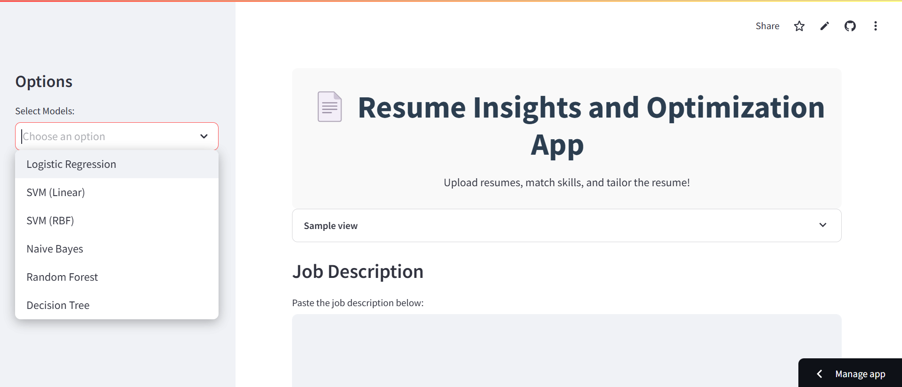
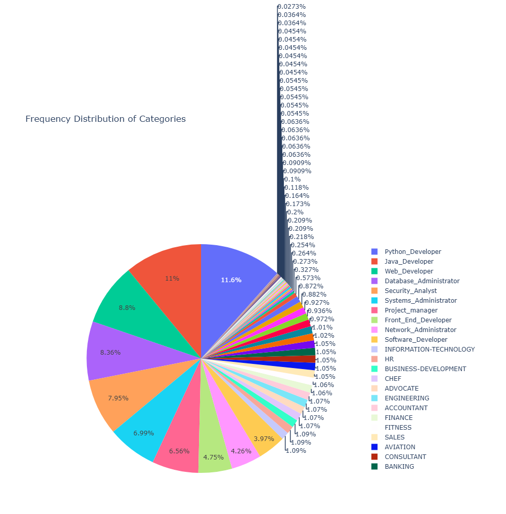
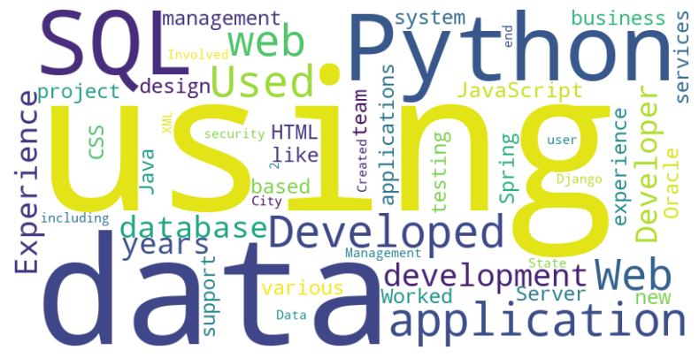
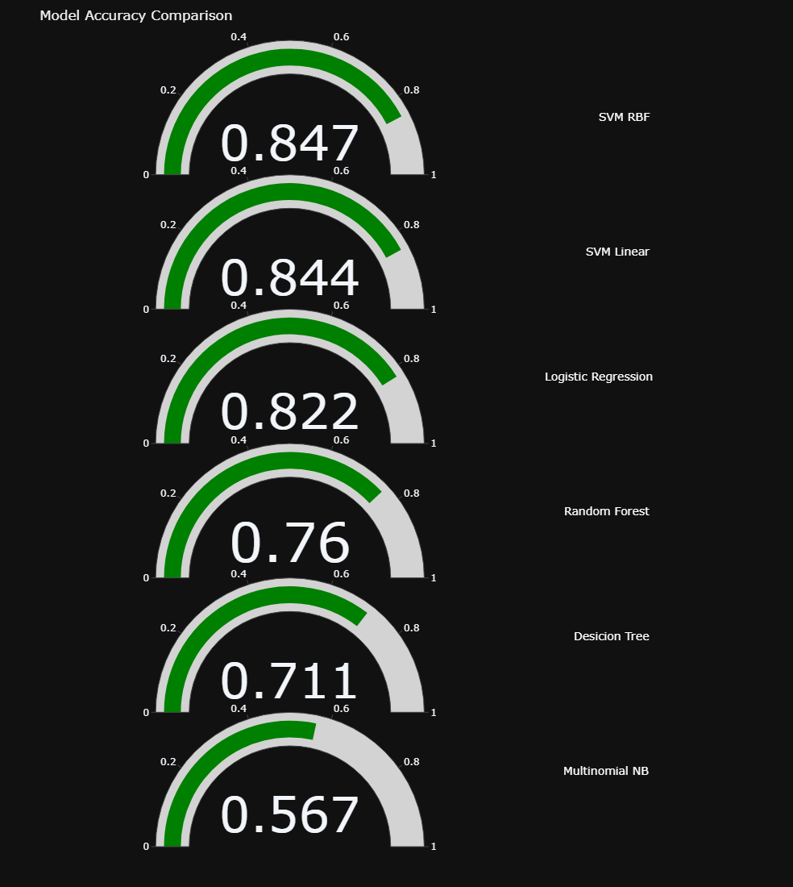
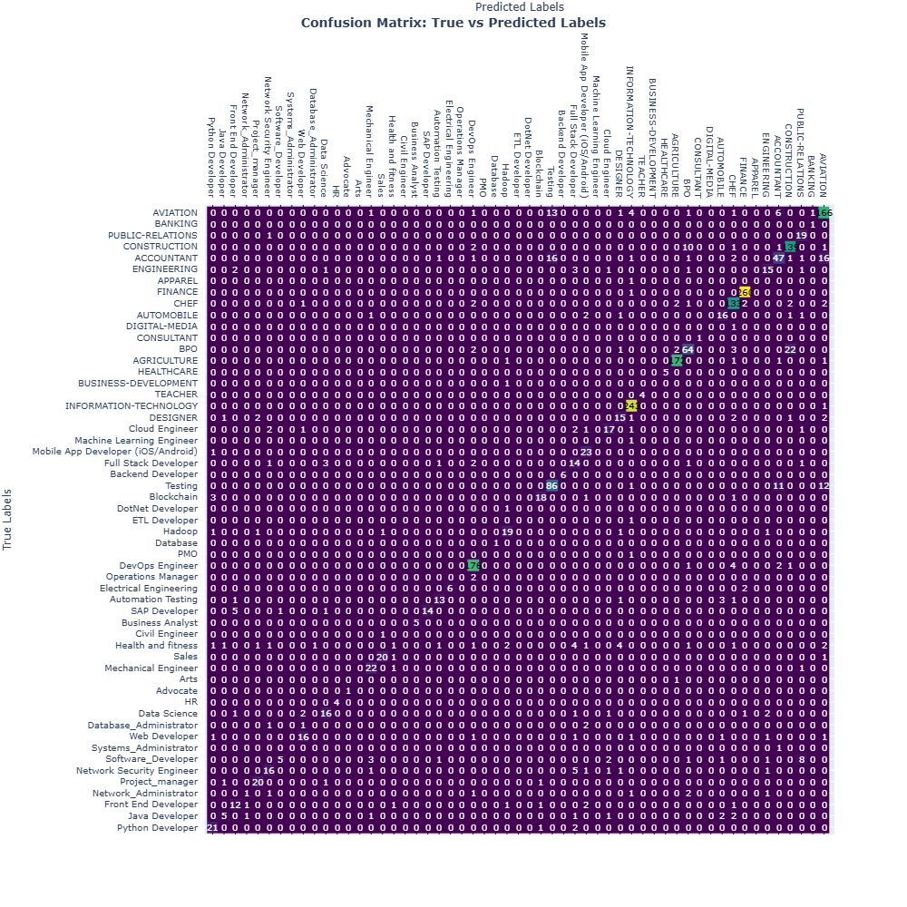
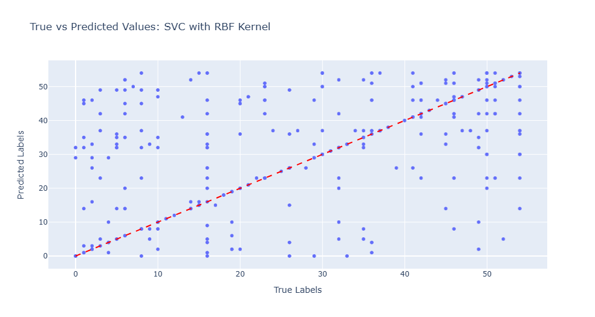
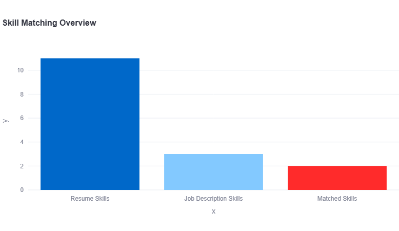
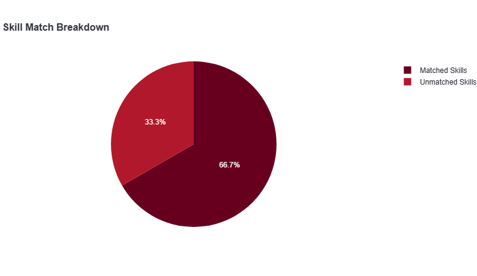
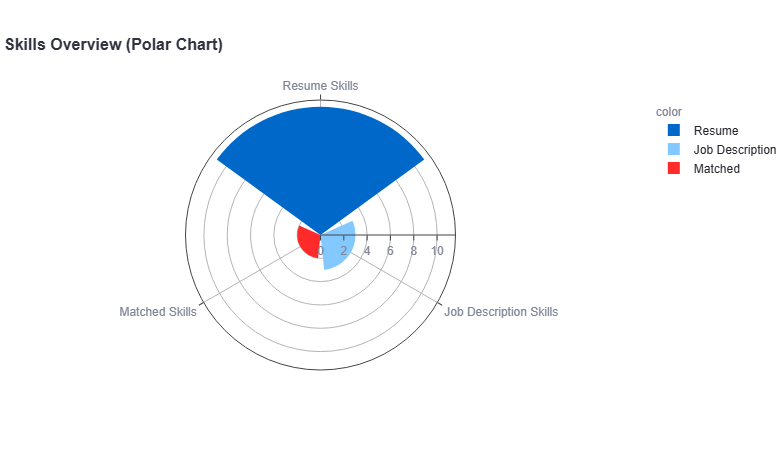

# Resume Insights and Optimization

## 1. Title and Author

* **Project Title**: Resume Insights and Optimization
* **Author Name**: Sreya Sree Siloju
* **Semester**: FALL'24
* **Prepared for**: UMBC Data Science Master Degree Capstone by Dr. Chaojie (Jay) Wang
* **GitHub Repository**: [GitHub Repo](https://github.com/sreya0299)
* **LinkedIn Profile**: [LinkedIn Profile](https://www.linkedin.com/in/sreya-sree-siloju-a29224149/)
* **PowerPoint Presentation**: [Power Point Presentation](https://github.com/sreya0299/UMBC-DATA606-Capstone/blob/main/docs/RESUME%20INSIGHTS.pptx)
* **YouTube Video**: [YouTube Video](https://youtu.be/uVsrVjCWryg)
* **Streamlit App**: [Streamlit App](https://umbc-data606-capstone-jwd6on3zvtdlqcbacc2fny.streamlit.app/)
  
---

## 2. Background

### What is it About?
This Project analyzes resumes to extract key details like skills, experience, and education. It offers suggestions for improving the resume by identifying missing skills, enhancing readability, and matching it to job descriptions. The system may also recommend relevant job positions and provide feedback to make resumes more ATS-compliant. It involves natural language processing (NLP) and machine learning to perform tasks like resume parsing, skill matching, and personalized job recommendations. It helps job seekers optimize their resumes for specific roles.

### Why Does it Matter?
1. **Improves Resume Shortlisting**: It allows candidates to tailor their resumes to specific job descriptions by recommending skills or qualifications they may lack, increasing their chances of aligning with job description.
2. **Reduces Time and Effort**: This automates the resume review process, allowing job seekers to quickly understand what improvements are needed while helping recruiters filter out unqualified candidates more efficiently.
3. **Enhances personalised Skill Development**: By identifying gaps in a resume and suggesting relevant skills or certifications, the system encourages continuous learning and professional development, aligning candidates with current market demands.

### Research Questions:
1. **Model Effectiveness**: How effectively does the model identify skill gaps between a candidate's resume and industry-standard requirements?
2. **Handing Multiple Resumes**: How well does the model handle various resume structures and formats when extracting relevant information?
3. **Skill Upgrade Recommendation**: How accurately can the model predict suitable job roles based on the skills and experience presented in the resumes?

---

## 3. Data

### Data Sources:
**Dataset 1**
* [Dataset 1](https://www.kaggle.com/datasets/jillanisofttech/updated-resume-dataset)
* **Data Size**: 3.11 MB
* **Data Shape**: 962 X 2
* The dataset contains 962 rows and 2 columns

**Dataset 2**
* [Dataset 2](https://www.kaggle.com/datasets/snehaanbhawal/resume-dataset)
* **Data Size**: 118.29 MB
* **Data Shape**: 2484 X 4
* The dataset contains 2484 rows and 4 columns

**Dataset 3**
* [Dataset 3](https://www.kaggle.com/datasets/jithinjagadeesh/resume-dataset)
* **Data Size**: 338.76 KB
* **Data Shape**: 400 X 2
* The dataset contains 400 rows and 2 columns

**Dataset 4**
* [Dataset 4](https://www.kaggle.com/datasets/avishekmajhi/resume-dataset)
* **Data Size**: 64.58 MB
* **Data Shape**: 8234 X 2
* The dataset contains 8234 rows and 2 columns 

### Representation of Dataset ?
* **Category**: Each row represents the category to which the resume belongs 
* **Resume**: Resume columns consists of resumes of each individual in the raw text.

### Data Dictionary:

| **Column Name** | **Data Type** | **Definition** | **Values**                            |
|-----------------|---------------|----------------|---------------------------------------|
| category        | string        | The field that the resume corresponds to, It indicates the type of job the resume is targeting.  | Java Developer, Operations Manager, Data Science, Testing etc. |
| Resume          | string        | The textual content of the resume contains the complete resume of an individual in raw text format, including their skills, education, experience, personal deatils etc.     | NA |

**Target/Label**:

1. **Category**: It is used as the **target** variable for classification tasks in which the model will attempt to predict the appropriate job category based on the content of the resume.

2. **Feature/Predictors**:
**Resume**: It contains the text of the resumes and is the **feature**. It is the input data that will be processed to extract relevant information (skills, experience, education etc.) to predict the target category.
The in-depth features that are extracted from each resume are:
* **Skills**:
  * **Technical Skills**: Programming languages (e.g., Python, Java), tools (e.g., Power BI, Tableau), and technologies (e.g., AWS, Azure).
  * **Soft Skills**: Communication, leadership, teamwork, problem-solving.
* **Education**:
  * **Degree Level**: Bachelor’s, Master’s, Ph.D.
  * **Field of Study**: Computer Science, Engineering, Finance, etc.
  * **Institutions**: Name of the universities or schools attended.
  * **Graduation Year**: Year the degree was completed.
* **Professional Experience**:
  * **Job Titles**: Positions held (e.g., Data Analyst, Software Engineer).
  * **Years of Experience**: The total number of years or specific time periods of work.
  * **Companies**: Names of companies or organizations where the individual worked.
  * **Job Responsibilities**: The tasks performed in each role.
* **Keywords and Phrases**:
  * Specific industry-related terms that are commonly found in job descriptions and are required for matching (e.g., "Machine Learning," "Data Analysis," "Project Management", "Big Data").

**Packages and Technologies**:
* Backend Development using **Python** programming language
* Text is converted into numericals using **TFID Vectorizer**, **KNeighborsClassifier** and **OneVsRestClassifier** are used for classification of the resume into it's category as there are multiple classes in the target variable.
* Machine Learning Packages are used for model training and model predicting to which the resume belongs to which helps in identifyinng the skills responsible for each category. 
* By using **NLTK**, the resume text is processed and cleaned, ensuring better input for further tasks like feature extraction and classification.
* **NLP** concepts like Named Entity Recognition (NER) are used for identifying the key words from the resume like skills, experience, technologies worked on etc.
* **Streamlit** is used for creating a web interface for evaluating the resume with provided job description.
---
## 4. Exploratory Data Analysis (EDA)

1. **Merging Datasets** : To consolidate data for analysis, utilized the concat function from the pandas library to merge four distinct datasets. This operation resulted in a unified dataset containing 11,003 rows and 2 columns. Each row represents a unique resume, and each resume is categorized according to its specific category. This structured format facilitates further analysis, allowing to explore the relationships and distributions of resumes across different categories effectively.
2. **Checking for NUll/Missing values** : The integrity of the dataset is crucial for accurate analysis. Conducted a thorough examination for any NULL or missing values using the *isna()* function. The outcome of this analysis revealed that there are no missing values within the dataset. Consequently, proceeded with the analysis without the need to address any missing data, ensuring that findings are based on a complete dataset.
3. **Handling Duplicate Values** : To ensure the model is trained on the unique values, the data given to it should be distinct without consisting of rendundant rows. The number of duplicated rows present in the dataset is given by *duplicated* function. The duplicates are dropped from the dataset using *.drop_duplicates()* function of dataframe.
4. **Identifying the unique categories**: Standardizes various representations of the same category by mapping them to a consistent label, such as consolidating *Python_Developer* and *Python Developer* into *Python Developer* and same with the *Java_Developer* and remaining categories. This enhances clarity, facilitates analysis, and reduces redundancy in the dataset, making it easier to work with and maintain as new variations are identified.
5. **Statistics of Dataset** : To gain insights into the dataset’s composition, employed the *describe(include='all')* function. This summary statistic provides a comprehensive overview of the dataset, including:
    1. Count: The total number of records, which is 11,003.
    2. Unique Values: The total number of distinct categories present in the dataset, totaling 62 unique categories.
    3. Most Frequent Data: The function also identifies the most frequently occurring data points, presenting their respective frequencies. This information is invaluable as it highlights the dominant categories and resume types, guiding focus for further exploration and analysis.
6. **Distribution of Categories**: Analyzing the distribution of the categories is essential to understand how the resumes are spread across different categories. Dataset includes 65 unique categories, and the distribution is not uniform. Some categories may contain a significantly higher number of resumes compared to others, indicating possible trends or preferences in resume submissions. Utilized *Plotly Express* to visually represent this distribution, creating interactive plots that illustrate the frequency of resumes within each category. This visual exploration aids in identifying categories that may require deeper analysis or consideration for future projects.
  
* **Categories with frequency**
  
| **Category**    | **Count** |
|-----------------|---------------|
|	Python Developer	|	1306	|
|	Java Developer	|	1219	|
|	Web Developer	|	972	|
|	Database_Administrator	|	920	|
|	Network Security Engineer	|	880	|
|	Systems_Administrator	|	769	|
|	Project_manager	|	722	|
|	Front End Developer	|	547	|
|	Network_Administrator	|	469	|
|	Software_Developer	|	437	|
|	Advocate	|	128	|
|	Health and fitness	|	123	|
|	Sales	|	121	|
|	BUSINESS-DEVELOPMENT	|	120	|
|	INFORMATION-TECHNOLOGY	|	120	|
|	HR	|	120	|
|	ENGINEERING	|	118	|
|	CHEF	|	118	|
|	ACCOUNTANT	|	118	|
|	FINANCE	|	117	|
|	AVIATION	|	116	|
|	CONSULTANT	|	115	|
|	BANKING	|	115	|
|	HEALTHCARE	|	115	|
|	CONSTRUCTION	|	112	|
|	PUBLIC-RELATIONS	|	111	|
|	Arts	|	109	|
|	DESIGNER	|	107	|
|	TEACHER	|	102	|
|	APPAREL	|	97	|
|	DIGITAL-MEDIA	|	96	|
|	AGRICULTURE	|	63	|
|	Data Science	|	39	|
|	AUTOMOBILE	|	36	|
|	Full Stack Developer	|	30	|
|	Cloud Engineer	|	23	|
|	Mobile App Developer (iOS/Android)	|	23	|
|	BPO	|	22	|
|	Backend Developer	|	19	|
|	Machine Learning Engineer	|	18	|
|	Database	|	11	|
|	DevOps Engineer	|	7	|
|	Testing	|	7	|
|	Hadoop	|	7	|
|	Automation Testing	|	7	|
|	DotNet Developer	|	7	|
|	SAP Developer	|	6	|
|	Civil Engineer	|	6	|
|	Business Analyst	|	6	|
|	Electrical Engineering	|	5	|
|	Mechanical Engineer	|	5	|
|	Blockchain	|	5	|
|	ETL Developer	|	5	|
|	Operations Manager	|	4	|
|	PMO	|	3	|

  
* **Bar Graph Distribution**
  * Dominant Category: *Python Developer* stands out as the most frequent category, making up a significant portion of the dataset. This dominance may lead to a bias, affecting the model's accuracy in classifying other categories.
  * Least Dominant Category: In contrast, *Advocate* is the least represented category, posing challenges for the model due to the limited training examples available.

* **Pie Chart Distribution**
  * Percentage Representation: *Python Developer* comprises 11.3% (about 1,371 resumes) of the total 11,003 resumes, reinforcing its dominance.
  * Minor Categories: The *Advocate* category accounts for only 0.166% (around 20 resumes), highlighting the difficulties the model may face in accurately classifying such underrepresented categories.

### Preporocessing Data

* **Cleaning the Resume**

  The *cleanResume* function serves as a crucial preprocessing step for analyzing resume text data. By systematically removing unnecessary elements, it enhances the quality of the input data for further processing, such as feature extraction, classification, and machine learning model training. This function is particularly valuable in scenarios where clean and structured text data is essential for generating insights and making accurate predictions in resume analysis and related fields.
  * **URL Removal**: Any web links present in the resume text are eliminated to focus on the content.
  * **Social Media Elements**: Mentions of retweets (RT) and carbon copies (CC), along with hashtags and user handles (e.g., @username), are removed to maintain a professional tone.
  * **Special Character Elimination**: Non-essential special characters are stripped away, helping to standardize the text and reduce noise.
  * **Non-ASCII Character Removal**: Characters outside the standard ASCII range are removed to ensure compatibility with various text processing tools.
  * **Whitespace Normalization**: Extra spaces, tabs, and newline characters are consolidated into single spaces, resulting in a cleaner layout.
  * **Alphanumeric Filtering**: Only letters, numbers, and spaces are retained, removing any irrelevant punctuation or symbols.
  * **Final Space Reduction**: Multiple consecutive spaces are replaced with a single space, enhancing the readability of the text.

* **Extracting the most frequent words**
  
  The *get_most_frequent_words* function is used to analyze a collection of resumes and identify the most commonly occurring words within that text. It serves purposes:
  * **Text Analysis**: By examining the frequency of words, the function helps highlight important skills, qualifications, and experiences presented in the resumes.
  * **Stop Word Removal**: It filters out common English words (like "and," "the," and "is") that do not provide significant information, focusing instead on more meaningful terms that reflect the candidates' competencies.
  * **Customization**: Users can specify additional words to exclude from the analysis, allowing for tailored results based on the context of the resumes being analyzed.
  * **Insights Generation**: The function counts the occurrences of filtered words and returns the most frequent ones, which can inform hiring decisions, identify trends in candidate skills, or enhance resume parsing systems.

**Most frequent words obtained from entire dataset**

**Most frequent words obtained from dataset with categories**

* **Labelling the categories**
  
  The process described involves converting categorical data into a numerical format suitable for machine learning models.
  * **Categorical Data Conversion**: The *LabelEncoder* is used to transform string labels representing different categories into numerical labels. This is essential because many machine learning algorithms require numerical input.
  * **Learning Unique Categories**: The method analyzes the unique categories present in the dataset, enabling it to understand how to assign numerical values to each category.
  * **Generating Numeric Labels**: Each category is then replaced with a corresponding numeric label, creating a new representation of the data. This allows the model to process the categories effectively.

**Labels for each category**

|Category|Label|
|--------|-----|
|	Python Developer	|	47	|
|	Java Developer	|	37	|
|	Front End Developer	|	30	|
|	Network_Administrator	|	42	|
|	Project_manager	|	46	|
|	Network Security Engineer	|	41	|
|	Software_Developer	|	50	|
|	Systems_Administrator	|	51	|
|	Web Developer	|	54	|
|	Database_Administrator	|	23	|
|	Data Science	|	21	|
|	HR	|	33	|
|	Advocate	|	5	|
|	Arts	|	6	|
|	Mechanical Engineer	|	39	|
|	Sales	|	49	|
|	Health and fitness	|	35	|
|	Civil Engineer	|	17	|
|	Business Analyst	|	13	|
|	SAP Developer	|	48	|
|	Automation Testing	|	7	|
|	Electrical Engineering	|	28	|
|	Operations Manager	|	43	|
|	DevOps Engineer	|	24	|
|	PMO	|	44	|
|	Database	|	22	|
|	Hadoop	|	34	|
|	ETL Developer	|	27	|
|	DotNet Developer	|	25	|
|	Blockchain	|	12	|
|	Testing	|	53	|
|	Backend Developer	|	11	|
|	Full Stack Developer	|	31	|
|	Mobile App Developer (iOS/Android)	|	40	|
|	Machine Learning Engineer	|	38	|
|	Cloud Engineer	|	18	|
|	DESIGNER	|	19	|
|	INFORMATION-TECHNOLOGY	|	36	|
|	TEACHER	|	52	|
|	BUSINESS-DEVELOPMENT	|	10	|
|	HEALTHCARE	|	32	|
|	AGRICULTURE	|	1	|
|	BPO	|	9	|
|	CONSULTANT	|	16	|
|	DIGITAL-MEDIA	|	20	|
|	AUTOMOBILE	|	3	|
|	CHEF	|	14	|
|	FINANCE	|	29	|
|	APPAREL	|	2	|
|	ENGINEERING	|	26	|
|	ACCOUNTANT	|	0	|
|	CONSTRUCTION	|	15	|
|	PUBLIC-RELATIONS	|	45	|
|	BANKING	|	8	|
|	AVIATION	|	4	|

* **Vectorization**
  * The **TF-IDF** Vectorizer (Term Frequency-Inverse Document Frequency) is a feature extraction tool from the Scikit-learn library that converts a collection of raw documents into a matrix of TF-IDF features. 
    1. **Term Frequency (TF)**: Indicates how frequently a term appears in a document.
    2. **Inverse Document Frequency (IDF)**: Reflects how important a term is across the entire corpus, assigning higher weights to rare terms and lower weights to common terms.
  * Extracts meaningful features from the text data contained within each resume.
  * Allows for the identification of key skills and qualifications by transforming the raw textual content into a numerical representation that highlights the importance of specific terms relative to the entire dataset.
  * Additionally, the TF-IDF scores help to filter out common words, ensuring that the analysis focuses on terms that provide significant insights into candidates' expertise. Ultimately, using the TF-IDF Vectorizer facilitates a more informed evaluation of resumes, supporting personalized job recommendations and improving the overall recruitment process.
---
## 5. Model Development
The dataset was split into training and testing subsets to prepare it for machine learning tasks. The training set comprises 80% of the data (8,802 rows), while the testing set makes up the remaining 20% (2,201 rows). Each subset contains 85,373 features. The **train_test_split** function with the stratify parameter was used to ensure that class proportions in both subsets mirrored the original dataset, preventing bias or imbalance. Stratified sampling preserves class balance, ensures reliable model evaluation, and minimizes bias by maintaining consistent class distributions. 
  1. The X_train contains contains 8802 rows and 85373 columns.
  2. The y_train consists of 8802 rows.
  3. The X_test consists of 2201 rows and 85373 columns.
  4. The y_test consists of 2201 rows.

 **Models used for training**
 1. **Logistic Regression**: **Logistic Regression** model was implemented using the **OneVsRestClassifier** to handle multi-class classification, with a maximum iteration limit of **1,000** to ensure convergence. The model was trained on the training dataset *(X_train, y_train)* and used to predict categories for the testing dataset *X_test*. The accuracy of the predictions was evaluated using the **accuracy score** metric, achieved an accuracy of **0.82**, demonstrating its effectiveness in multi-class classification tasks and its balanced performance across different categories.
 2. **Support Vector Machine**: **Support Vector Machine** is a supervised learning model used for classification tasks, works by finding the optimal hyperplane that separates data points of different classes. SVMs can utilize different kernel functions, such as **linear** and **radial basis function (RBF)**, to map data into higher-dimensional spaces for better classification.
    1. **Linear**: The SVM classifier was implemented using the *OneVsRestClassifier* wrapper with an SVM configured to use a *linear kernel*. This kernel is effective when the data is linearly separable, allowing the model to classify data by finding a straight decision boundary. The linear kernel excelled in cases where data was linearly separable, achieving an accuracy of **0.844**.
    2. **RBF**: The SVM classifier was implemented with an **RBF (Radial Basis Function)** kernel, which is well-suited for handling non-linear data. This kernel maps the data into a higher-dimensional space, enabling the separation of complex class boundaries. The RBF kernel handled non-linear patterns effectively, achieving an accuracy of **0.847**.
3. **Naive Bayes**: **Naive Bayes model** was implemented using the **MultinomialNB classifier** wrapped in a **OneVsRestClassifier** to handle multi-class classification tasks. This model is particularly suited for data represented by frequency counts or probabilities, as it assumes conditional independence between features given the class. The model's performance was evaluated using the accuracy score, achieving an accuracy of **0.567**.
4. **Random Forest Classifier**: **Random Forest model** was implemented using the **RandomForestClassifier** wrapped in a **OneVsRestClassifier** to handle multi-class classification tasks. Configured with 50 estimators and a fixed random state for reproducibility, the model leverages an ensemble of decision trees to enhance prediction accuracy and reduce overfitting. The model's accuracy, evaluated using the accuracy score metric, was found to be **0.76**, demonstrating its robustness in handling large and complex datasets while maintaining generalization across different classes.
5. **Decision Tree Classifier**: **Decision Tree model** was implemented using the **DecisionTreeClassifier** wrapped in a **OneVsRestClassifier** for multi-class classification. Configured with a fixed random state for reproducibility, the model builds a tree structure to partition the data based on feature values, effectively learning class boundaries. The model's performance, evaluated using the accuracy score metric, achieved an accuracy of **0.71**, showcasing its ability to handle classification tasks with interpretable and straightforward decision-making processes.

**Metric Evaluation**

After evaluating all the models, the **SVM** with the **RBF kernel** emerged as the best model with an accuracy of **0.847**. This model demonstrated exceptional performance by effectively capturing the complex relationships in the data, handling non-linear patterns, and providing accurate categorizations for resume classification. Given its superior accuracy and ability to deal with non-linear decision boundaries, the SVM with RBF kernel was chosen for the further categorization of resumes, ensuring high-quality predictions for job role classification.

**Ensuring that SVM RBF is the best model**
* **Confusion Matrix**
  
    * To evaluate the performance of the SVM model with a rbf kernel on the resume categorization task. After predicting the labels for the test dataset using the trained model, the confusion_matrix function from sklearn.metrics computes the matrix, which compares the true labels *y_test* with the predicted labels *ypred*. The matrix is annotated with the *job roles* on both the x and y axes, making it easy to identify which job roles were correctly or incorrectly predicted. The color scale, set to *Viridis*, helps highlight areas of the matrix with higher values, indicating where the model performed well or poorly. This visualization allows for a clear understanding of how well the model classified each job role and identifies areas for improvement in classification performance.
   

* **Scatter Plot**
  
   * Scatter plot to visually compare the true and predicted values for the SVC model with the RBF kernel on the resume categorization task. The scatter plot is then generated using Plotly's *px.scatter*, with the true values plotted on the x-axis and the predicted values on the y-axis. This visualizes how close the model's predictions are to the actual values. The red dashed line is added to the plot to represent the "perfect prediction line" (y = x), where the true values perfectly match the predicted values. This line serves as a reference to easily identify how well the model's predictions align with the true labels. Points that lie on or near the red line indicate accurate predictions, while points far from the line highlight misclassifications. 
   

---
## 6. Streamlit Implementation
App is developed to streamline the process of resume screening and optimization. The application leverages machine learning models, Natural Language Processing (NLP), and data visualization techniques to analyze resumes and match them with job descriptions, highlighting key skills and categorizing the resumes for specific job roles. The machine learning model is serialized using pickle and can be easily loaded to make predictions on new resumes. The text data from the resumes is preprocessed using TF-IDF (Term Frequency-Inverse Document Frequency) to transform the text data into numerical vectors for model input. This vectorized representation helps the machine learning models analyze the text and make predictions effectively.
1. **Skill Extraction and Matching** : The application can extract specific skills from the resumes and job descriptions using NLP techniques. It compares the skill sets listed in the job description with the ones mentioned in the resume. The common skills between the two are identified, and the match percentage is calculated, indicating how well the resume aligns with the job description.
2. **Visualization of Results**: The app uses Plotly to create several interactive visualizations to provide a deeper insight into the results
   1. **Bar Charts**: Visualizing the number of skills in the resume, the job description, and the common skills.
   2. **Pie Charts**: Breaking down the matched and unmatched skills.
   3. **Polar Charts**: Offering a visual comparison of the skills in the resume and job description.
3. **Job Role Categorization**: This categorizes the resume into one of several predefined job roles, using the predictions from the machine learning models. The categories are mapped to a set of predefined job titles (e.g., Python Developer, Data Scientist, Project Manager). These predictions provide an initial classification of the resume, helping job seekers or recruiters quickly identify potential matches for specific job roles.
4. **Skill Matching and Recommendations**: After categorizing the resume, the app evaluates the skill match between the resume and the job description. This provides actionable insights on what skills are missing or need further emphasis. If the skills in the resume do not align with the job requirements, the app recommends adding relevant skills that are important for the role.
5. **User Interface and Experience**: The app is designed with Streamlit, offering an intuitive and easy-to-use interface. Users can upload resumes in various formats (PDF, DOCX, TXT), input job descriptions. The results are displayed in a clear and engaging manner, with visual charts and tables summarizing the analysis.

**UI of the streamlit application**

The visualizations of the job descriptions with the resume are provided below 
* Bar Plot:
  * 
 
* Pie Plot:
  * 
 
* Polar Plot:
  * 
  
The link to access the application for uploading the resumes and analyzing them in accordance with job descriptions.
* **Streamlit UI**: [Streamlit App](https://umbc-data606-capstone-khtcappnhvnslcitctn6dpm.streamlit.app/)
---
## 7. Future Improvements
In Future, the improvements that can be made in the app for the better User Interface and the analysis of the resumes, the following features can be taken into consideration.
1. **Enhanced Skill Extraction**: Integration of more advanced NLP techniques like Named Entity Recognition (NER) to better identify job-specific skills.
2. **Better Model Performance**: Experimenting with deep learning models to improve accuracy.
3. **Job Role Prediction**: Extending the categorization to a larger set of job roles using more diverse training data.
---
## 8. Conclusion
The **Resume Insights and Optimization App** is an innovative solution for improving the efficiency of the recruitment process. It leverages machine learning and NLP to automate the analysis and optimization of resumes, helping candidates tailor their resumes to meet job requirements and enabling recruiters to make more informed decisions. By integrating various tools for skill extraction, job categorization, and data visualization, the app provides a comprehensive and user-friendly experience for resume analysis and optimization. The ability to handle multiple resume formats (PDF, DOCX, TXT) and evaluate various models for prediction provides a flexible solution for real-world applications. By incorporating this tool, companies can reduce manual efforts in resume evaluation and make more informed decisions in hiring, ultimately improving both recruitment efficiency and job fit. Future improvements can include integrating more advanced models, expanding the skill set database, and enhancing the overall user interface for better accessibility and performance.

